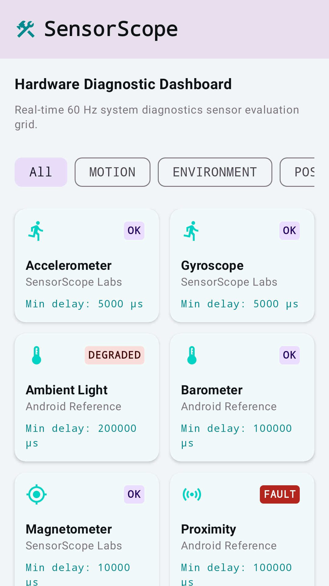
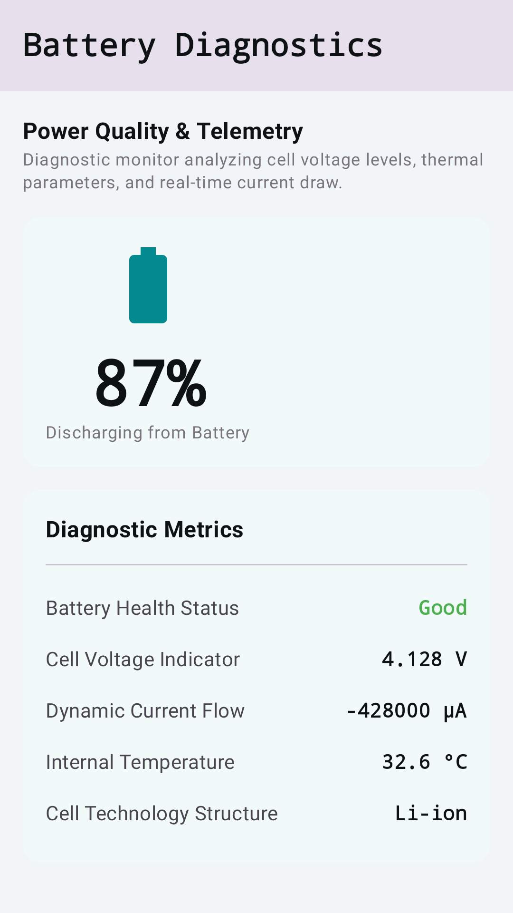
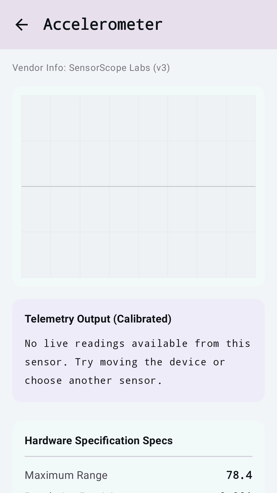
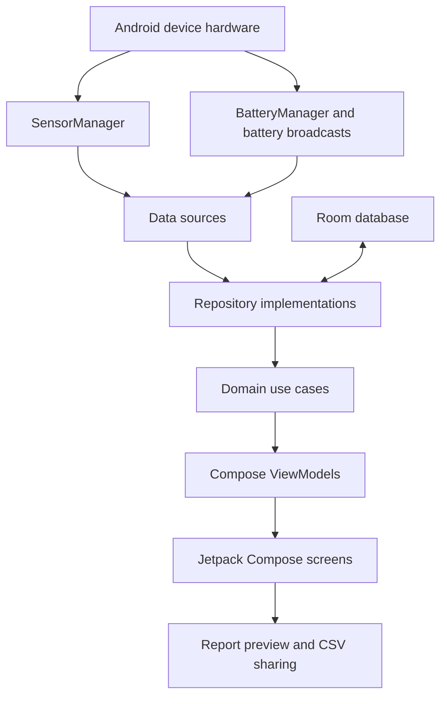

# SensorScope


SensorScope is an Android hardware diagnostics app for inspecting device sensors, battery telemetry, and thermal stress
behavior in real time. It is built for technicians, QA teams, Android developers, and power users who need a clear view
into the hardware signals exposed by a device.

Demo link: Not configured.

<table>
  <tr>
    <td></td>
    <td></td>
    <td></td>
  </tr>
</table>

## Project Overview

SensorScope gives Android users a focused diagnostic dashboard for sensors, battery state, thermal checks, calibration
baselines, and report previews. The app reads local device telemetry, stores diagnostic baselines and thermal logs on the
device, and lets users export CSV snapshots only when they choose to share them.

The repository also includes generated Play Store assets and listing copy under `play-store/`.

## Key Features

- 📡 Real-time sensor inventory grouped into motion, environment, position, and unknown hardware categories.
- 📈 Sensor detail screens with live stream plotting and calibrated X, Y, and Z readouts.
- 🔋 Battery telemetry for level, voltage, current, temperature, charging state, technology, and anomaly warnings.
- 🌡️ Thermal stress sandbox with foreground-service execution, stop controls, summaries, and historical logs.
- 🎯 Calibration baseline capture and clearing for supported sensors.
- 🧪 Dead-pixel inspection screen with an immersive display check flow.
- 📄 Diagnostic report preview and CSV snapshot export support.
- 🛒 Play Store screenshot, icon, feature graphic, and listing-copy assets tracked in the repository.

## Architecture Overview



### Components

`MainActivity` hosts a Compose `NavHost` with dashboard, sensor detail, dead-pixel, thermal stress, battery telemetry,
calibration, and report-preview destinations. `SensorScopeApp` creates an `AppContainer`, which wires data sources,
repositories, Room DAOs, and use cases without a third-party dependency-injection framework.

`SensorDataSourceImpl` wraps `SensorManager` as Kotlin `Flow` streams. `BatteryDataSourceImpl` converts Android battery
broadcasts and `BatteryManager` properties into domain readings. `SensorScopeDatabase` persists calibration baselines and
thermal stress logs with Room.

### Data Flow

Device hardware emits sensor and battery events. Data sources convert Android framework callbacks into domain models,
repositories combine live readings with local Room state, use cases expose focused operations to ViewModels, and Compose
screens render the current state or trigger actions such as baseline capture and report export.

### Design Patterns

The app uses a layered architecture with data sources, repositories, use cases, ViewModels, and Compose UI. Runtime state
is modeled with Kotlin coroutines and `Flow`; local persistence uses Room DAOs; navigation uses Jetpack Navigation
Compose.

## Tech Stack & Libraries

| Layer | Technology | Version | Purpose |
|---|---:|---:|---|
| Platform | Android SDK | min 24, target 36, compile 36.1 | Android app runtime and framework APIs |
| Language | Kotlin | 2.2.10 | App and test implementation |
| Build | Gradle Wrapper | 9.5.1 | Reproducible Android builds |
| Build Plugin | Android Gradle Plugin | 9.1.1 | Android application packaging |
| UI | Jetpack Compose BOM | 2024.09.00 | Declarative UI toolkit |
| UI | Material 3 | BOM-managed | App components, navigation bar, icons, and theming |
| Navigation | Navigation Compose | 2.8.9 | In-app route graph |
| Async | Kotlin Coroutines | 1.10.2 | Sensor and battery streams |
| Persistence | Room | 2.7.0 | Calibration and thermal log storage |
| Images | Coil Compose | 2.7.0 | Image loading support |
| Network | Retrofit, OkHttp, Moshi | 2.12.0, 4.10.0, 1.15.2 | Available networking stack |
| Screenshots | Roborazzi | 1.59.0 | Play Store screenshot and graphic generation |
| Tests | JUnit, Robolectric, AndroidX Test | 4.13.2, 4.16.1, 1.6.x | JVM and Android-facing tests |
| Secrets | Secrets Gradle Plugin | 2.0.1 | `.env` loading for optional local secrets |

## Prerequisites

- macOS, Linux, or Windows with Android Studio installed.
- JDK 17 or newer. Android Studio bundled JDK is usually sufficient.
- Android SDK platform matching compile SDK 36.1.
- Android device or emulator running Android 7.0/API 24 or newer.
- Network access for the first Gradle dependency download.

| Variable | Required | Default | Description |
|---|---:|---|---|
| `GEMINI_API_KEY` | No | `MY_GEMINI_API_KEY` in `.env.example` | Reserved by the existing secrets setup; current diagnostics features do not require a live key. |
| `KEYSTORE_PATH` | Release only | `my-upload-key.jks` | Path to the release upload keystore. |
| `STORE_PASSWORD` | Release only | Not configured | Release keystore store password. |
| `KEY_PASSWORD` | Release only | Not configured | Release key password. |

## Installation & Setup

1. Clone the repository:

   ```bash
   git clone https://github.com/michaelsam94/SensorScope.git
   cd SensorScope
   ```

2. Create a local environment file if you need Gradle secrets:

   ```bash
   cp .env.example .env
   ```

3. Open this folder in Android Studio, let Gradle sync, and select an emulator or physical Android device.

4. Build a debug APK:

   ```bash
   ./gradlew assembleDebug
   ```

5. Install the debug app on a connected device:

   ```bash
   ./gradlew installDebug
   ```

6. Database setup is automatic. Room creates `sensorscope_database` on the device when the app first needs local storage.

## Configuration

The Android application configuration lives in `app/build.gradle.kts`. Important values include `applicationId`,
`namespace`, `minSdk`, `targetSdk`, `versionCode`, `versionName`, signing configs, and test options. Changing build
configuration requires a Gradle sync or rebuild.

Local secrets are read from `.env` through the Secrets Gradle Plugin. Release signing can be configured with
`KEYSTORE_PATH`, `STORE_PASSWORD`, and `KEY_PASSWORD`; avoid committing production signing secrets.

## Usage / Quick Start

### Run the App on a Device

```bash
./gradlew installDebug
```

Open SensorScope from the launcher. Use the bottom navigation to switch between Sensors, Screen, Thermals, Power,
Offsets, and Dossier. Sensor detail screens are opened from the dashboard by selecting a listed hardware sensor.

### Generate Play Store Assets

```bash
./gradlew generatePlayStoreAssets
```

Generated screenshots and graphics are written to `play-store/`. Listing copy is maintained in
`play-store/listing-descriptions.md`.

## API Reference

Not applicable. SensorScope is a native Android application and does not expose a public HTTP API, CLI API, or SDK API.
Internal app operations are organized through Kotlin repository interfaces in
`app/src/main/java/com/michael/sensorscope/domain/repository/`.

## Project Structure

```text
.
├── README.md                          # Project README
├── app/
│   ├── build.gradle.kts               # App build, dependencies, signing, test config
│   ├── proguard-rules.pro             # Release shrinker rules
│   └── src/
│       ├── main/                      # Compose app, data, domain, resources, manifest
│       ├── test/                      # JVM, Robolectric, Compose, and Roborazzi tests
│       └── androidTest/               # Instrumented Android tests
├── gradle/
│   ├── libs.versions.toml             # Version catalog
│   └── wrapper/                       # Gradle wrapper files
├── play-store/                        # Generated screenshots, icon, feature graphic, listing copy
├── branding/                          # App icon source artwork
├── build.gradle.kts                   # Top-level Gradle plugin declarations
└── settings.gradle.kts                # Gradle repositories and module includes
```

## Testing

Run JVM unit, Robolectric, and Compose tests:

```bash
./gradlew testDebugUnitTest
```

Run instrumented tests on a connected device or emulator:

```bash
./gradlew connectedDebugAndroidTest
```

Regenerate Roborazzi-backed Play Store screenshots:

```bash
./gradlew generatePlayStoreAssets
```

Test files live under `app/src/test/java/com/michael/sensorscope/` and
`app/src/androidTest/java/com/michael/sensorscope/`. Existing tests include navigation behavior, feature interaction
coverage, manifest permission checks, example Robolectric tests, and Play Store screenshot generation tests. Coverage
reporting is not configured.

## Deployment

### Android Debug Builds

```bash
./gradlew assembleDebug
```

The generated APK is written under `app/build/outputs/apk/debug/`.

### Android Release Builds

```bash
export KEYSTORE_PATH=/absolute/path/to/upload-key.jks
export STORE_PASSWORD
export KEY_PASSWORD
./gradlew assembleRelease
```

Release output is written under `app/build/outputs/apk/release/`. A release AAB task may also be used through standard
Android Gradle Plugin tasks when Play Console upload packaging is needed.

Docker and docker-compose deployment are not configured.

## Contributing

1. Fork the repository and create a short feature branch such as `feature/sensor-export` or `fix/battery-warning`.
2. Use Conventional Commits where practical, for example `feat: add report export state` or `fix: handle missing sensor`.
3. Run `./gradlew testDebugUnitTest` before opening a pull request.
4. Include screenshots or Roborazzi updates when a Compose UI change affects visible screens.
5. Keep package paths under `com.michael.sensorscope` and follow the existing data/domain/feature layering.

PR checklist:

- Tests or an explanation of why tests are not applicable.
- No committed production signing secrets.
- Updated Play Store assets or listing copy when store-facing UI changes.
- Android Studio sync succeeds from this project folder.

`./docs/CONTRIBUTING.md` is not configured in this repository.

## Roadmap

- [ ] Add a first-party `docs/CONTRIBUTING.md` with build, style, and release guidance.
- [ ] Configure coverage reporting for JVM and Compose tests.
- [ ] Add signed AAB release documentation for Play Console uploads.
- [ ] Add optional export destinations beyond local CSV sharing.
- [ ] Publish a stable privacy-policy URL and link it from this README.

## License

License: Not configured. No `LICENSE` file is present in this repository.

Copyright: Not configured.

## Acknowledgements & Credits

SensorScope is built with Android, Kotlin, Jetpack Compose, Material 3, Navigation Compose, Room, Kotlin Coroutines,
Robolectric, AndroidX Test, and Roborazzi. The Play Store asset workflow uses repository-local screenshots and listing
copy under `play-store/`.
